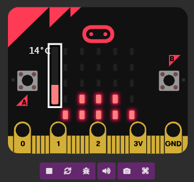
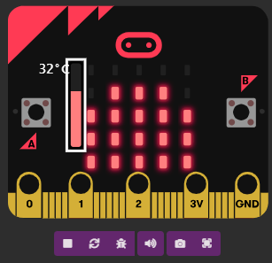
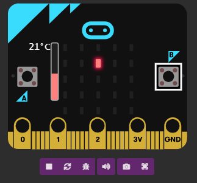

# Acciones de botones
---
## Boton A 

Hace que se muestre una grafica con la temperactura actual que detecte el Microbit

| Frio  | calor | 
|:------:|:------:|
|  |  | 

## Boton B 

Al oprimir el botón B, se iniciará una simulación de una gota por las luces LED, es decir, según la inclinación del micro:bit, se encenderá un determinado LED al mismo tiempo que se apaga el anterior, simulando un movimiento.

| Movimiento A  | Movimineto B | 
|:------:|:------:|
|  |  | 
